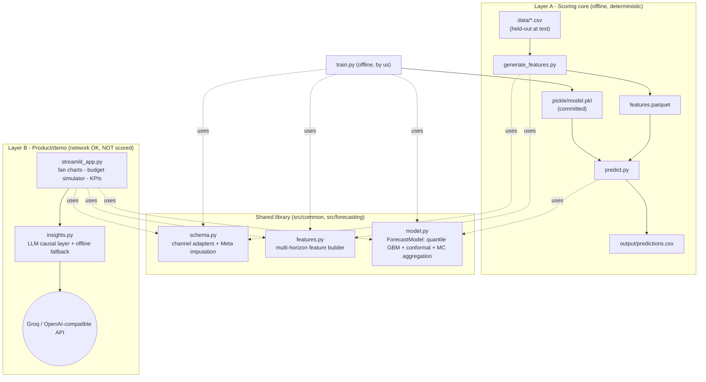

# Architecture

## The two-layer split (the core decision)

The submission is graded by an **offline automated pipeline** *and* by **human
judges**. These want different things, so the system is split so neither
compromises the other:

- **Layer A - Scoring core.** Deterministic, no-network, pickled model behind
  `run.sh`. Its only job: produce an accurate `predictions.csv` on held-out data.
- **Layer B - Product/demo.** Streamlit dashboard + LLM causal insights + budget
  simulator. Uses the network freely. **Never imported by `run.sh`.**



## Stacks

| Concern | Choice | Why |
|---|---|---|
| **Backend / forecasting** | Python 3.10, pandas, numpy | ubiquitous, reproducible |
| **Model** | LightGBM quantile regression + conformal calibration | strong tabular accuracy, honest intervals, pickles cleanly, offline |
| **Feature/IO** | pyarrow (parquet) | fast, typed intermediate handoff |
| **Frontend** | Streamlit + Plotly | fastest path to an interactive, chart-rich demo |
| **LLM** | provider-agnostic OpenAI-compatible via `requests` | free (Groq) + swappable + offline fallback |

## The forecasting pipeline (Layer A, step by step)

1. **`run.sh`** sets `PYTHONPATH`, resolves args (`DATA_DIR MODEL_PATH
   OUTPUT_PATH`) with defaults, `mkdir -p` the output dir, and runs two Python
   steps under `set -euo pipefail`.
2. **`generate_features.py`** -> `schema.load_channel_data()` (auto-detect,
   unify, impute Meta) -> `features.build_inference()` (one row per active
   campaign x horizon, run-rate planned spend) -> `features.parquet`.
3. **`predict.py`** imports `ForecastModel` (so the pickle resolves), loads
   `model.pkl`, calls `model.predict_frame()` -> quantile prediction + conformal
   widening + Monte-Carlo grain aggregation -> `output/predictions.csv`.

## LLM integration workflow (Layer B)

```
forecast + recent channel facts  - build_context()  (compact, faithful JSON)
                                        |
                       +----------------+-----------------+
                 key present?                         no key / offline
                       |                                   |
              llm_generate() -- OpenAI-compatible     render_fallback()
              (Groq etc.) POST /chat/completions      (deterministic rules)
                       |                                   |
                       +---------- markdown briefing  --+
```
The model is only ever asked to *interpret* our numbers, never to compute them.

## Reproducibility & the test contract

- **Seeds** fixed (`42`) in training and Monte-Carlo.
- **No absolute paths**; entry scripts bootstrap `sys.path` so `src` is
  importable from any CWD (portable across the Linux scorer and Windows).
- **No network** in Layer A; **pinned** versions so the pickle unpickles under
  the same LightGBM/numpy.
- **Minimal `requirements.txt`** (4 packages) for the scored path; demo-only
  deps live in `requirements-app.txt` to shrink the grader's install surface.
- Run artifacts (`output/`, `features.parquet`) are git-ignored and regenerated.
